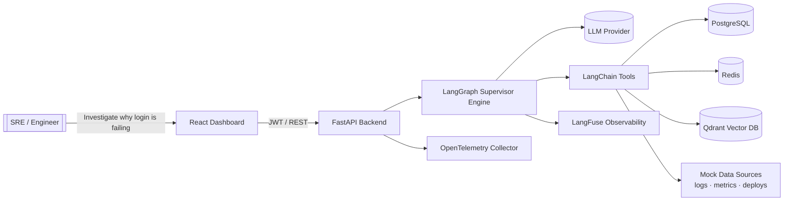
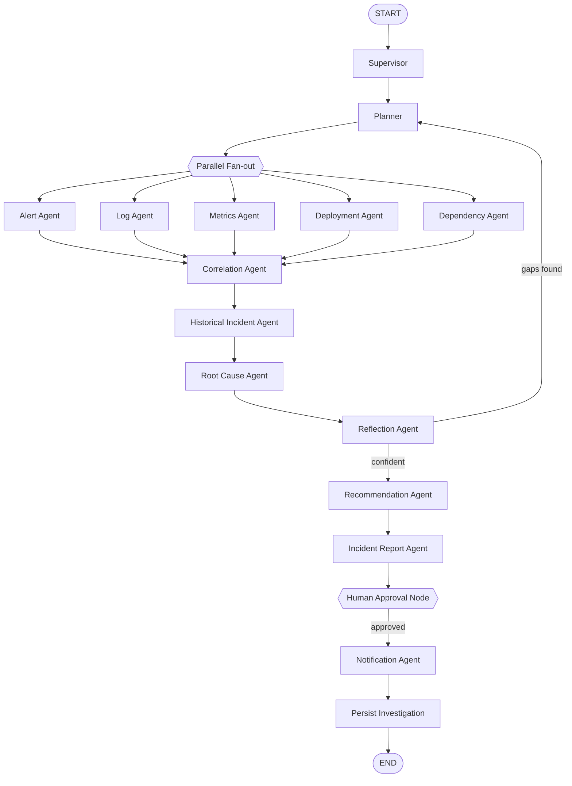

# SentinelAI — Architecture

**Autonomous Incident Response Engineer**

An enterprise AI platform that autonomously investigates production incidents by correlating
logs, metrics, deployments, and historical knowledge; determines probable root causes;
recommends remediation; and assists engineers during live incidents.

---

## 1. Architectural Principles

| Principle | Application in SentinelAI |
|-----------|---------------------------|
| **Clean Architecture** | Dependencies point inward: `api → services → repositories → domain`. Infrastructure is injected. |
| **Domain-Driven Design** | Core incident/investigation concepts live in `domain/` free of framework code. |
| **Repository Pattern** | All persistence hidden behind repository interfaces (`repositories/interfaces`). |
| **Dependency Injection** | Wiring in `app/config/container.py`; routes/services receive collaborators, never construct them. |
| **Interface-first** | Every service and data provider has an abstract interface so mocks are swappable for real providers. |
| **No logic in routes** | API routes only validate input, call an application service, and serialize output. |

### Layered dependency rule

```
┌──────────────────────────────────────────────────────────────┐
│  api/ (FastAPI routes, request/response schemas)               │  interface adapters
├──────────────────────────────────────────────────────────────┤
│  services/ (application use-cases, orchestration)              │  application layer
├──────────────────────────────────────────────────────────────┤
│  agents/ · graphs/ · tools/ (LangGraph multi-agent engine)     │  application layer
├──────────────────────────────────────────────────────────────┤
│  domain/ (entities, value objects, enums, domain services)     │  enterprise core
├──────────────────────────────────────────────────────────────┤
│  repositories/ · infrastructure/ (DB, Redis, Qdrant, LLM)      │  frameworks & drivers
└──────────────────────────────────────────────────────────────┘
```

Inner layers never import outer layers. `domain/` imports nothing framework-specific.

---

## 2. System Context



---

## 3. Multi-Agent Design

A **Supervisor Graph** orchestrates specialized agents. Each agent is a self-contained unit
with a system prompt, bound tools, a structured Pydantic output schema, retry logic, a
confidence score, error handling, and structured logging.

| Agent | Responsibility |
|-------|----------------|
| **Supervisor** | Owns control flow, routing decisions, and termination. |
| **Planner** | Turns the incident description into an ordered execution plan. |
| **Alert Analysis** | Inspects monitoring alerts. |
| **Log Analysis** | Retrieves and interprets K8s/Nginx/FastAPI/Postgres logs. |
| **Metrics Analysis** | Analyzes CPU, memory, latency time-series. |
| **Deployment Analysis** | Correlates recent deployments with incident onset. |
| **Dependency Analysis** | Checks upstream/downstream service health. |
| **Historical Incident** | Vector-searches Qdrant for similar past incidents. |
| **Correlation** | Fuses multi-signal evidence into a coherent timeline. |
| **Root Cause** | Produces ranked hypotheses with evidence & confidence. |
| **Recommendation** | Generates prioritized remediation with risk/justification. |
| **Reflection** | Critiques findings, checks for gaps, triggers re-investigation. |
| **Incident Report** | Assembles the executive/technical report. |
| **Notification** | Drafts stakeholder notifications. |

---

## 4. LangGraph Orchestration



- **Conditional routing:** Reflection can loop back to the Planner when evidence is insufficient.
- **Retries:** Each node has bounded retries tracked in `retry_count`.
- **Resumable execution:** LangGraph checkpointer (Postgres/Redis) enables pause at the Human
  Approval interrupt and resume after decision.

---

## 5. Strongly-Typed Graph State

`app/state/investigation_state.py` defines a `TypedDict` (with reducers) carrying:
Incident ID · Description · Execution Plan · Current Node · Completed Nodes · Logs · Alerts ·
Metrics · Deployments · Dependencies · Historical Matches · Root Cause Candidates ·
Recommendations · Incident Timeline · Confidence Scores · Errors · Retry Count ·
Human Approval Status · Generated Reports · Trace IDs · LangFuse Run IDs.

Parallel agent outputs merge via annotated reducers (e.g. `Annotated[list, operator.add]`).

---

## 6. LangChain Tools

Reusable, interface-backed tools: Log Search · Metrics Query · Deployment History ·
Incident Search · Vector Search · Python Execution (sandboxed) · SQL Query (read-only,
parameterized) · Markdown Report · PDF Report · Word Report · Chart Generation ·
Timeline Generator · Notification Generator.

Each tool depends on a **provider interface**. Mock providers ship first; real providers
(Loki, Prometheus, ArgoCD, etc.) drop in without touching agent code.

---

## 7. Data Sources (mock-first)

`infrastructure/datasources/` provides mock K8s / Nginx / FastAPI / Postgres logs, CPU /
memory / latency metrics, deployment history, incident history, and a knowledge base. The
system runs end-to-end on mock data; interfaces (`LogProvider`, `MetricsProvider`,
`DeploymentProvider`, …) allow real backends later.

---

## 8. Security

JWT access + refresh tokens · RBAC (Admin / SRE / Viewer) · Pydantic input validation ·
parameterized SQL (injection-safe) · prompt-injection mitigation (input scrubbing +
tool allow-lists) · rate limiting (Redis token bucket) · audit logging.

---

## 9. Observability

- **LangFuse:** every LLM call traced — prompt version, agent name, latency, tokens, cost,
  retries, failures, feedback, session/trace IDs. Each investigation returns a trace link.
- **OpenTelemetry:** distributed tracing across API and graph nodes.
- **Structured logging:** JSON logs with correlation IDs.
- **Health & metrics:** `/health`, `/health/ready`, `/metrics` endpoints.

---

## 10. Frontend

React + TypeScript + Tailwind + React Query + Axios + Recharts + Monaco + Markdown renderer.
Screens: Login · Dashboard · Live Incidents · Chat Investigation · Agent Execution Graph ·
Timeline · Root Cause View · Recommendations · Reports · Historical Incidents ·
LangFuse Trace Viewer · Settings.

---

## 11. Project Structure

```
backend/
  app/
    api/            FastAPI routers (v1)
    agents/         Specialized LangGraph agents
    graphs/         Supervisor graph assembly & checkpointing
    state/          Typed graph state + reducers
    prompts/        Versioned system prompts
    tools/          LangChain tools (interface-backed)
    repositories/   Repository interfaces + SQLAlchemy impls
    services/       Application use-cases / orchestration
    domain/         Entities, value objects, enums (framework-free)
    infrastructure/ DB, Redis, Qdrant, LLM, mock datasources
    models/         SQLAlchemy ORM models
    schemas/        Pydantic request/response DTOs
    middleware/     Auth, rate-limit, audit, error handlers
    config/         Settings, DI container, logging config
    memory/         Conversation / investigation memory
    observability/  LangFuse + OpenTelemetry setup
    utils/          Cross-cutting helpers
  tests/            unit · integration · agents · graph · api
  alembic/          Migrations
frontend/
  src/              components · pages · hooks · services · layouts · types · contexts · assets
docs/               Architecture, API, deployment guides
.github/workflows/  CI/CD
```

---

## 12. Phased Delivery Plan

| Phase | Scope |
|-------|-------|
| 1 | **High-level architecture & folder structure** ← *current* |
| 2 | DB schema, domain models, configuration |
| 3 | Authentication & user management |
| 4 | LangGraph state, orchestration, supervisor |
| 5 | Individual agents |
| 6 | LangChain tools |
| 7 | APIs |
| 8 | Frontend |
| 9 | LangFuse instrumentation |
| 10 | Docker, CI/CD, tests, documentation |

Each phase must compile and integrate cleanly with prior phases before proceeding.
